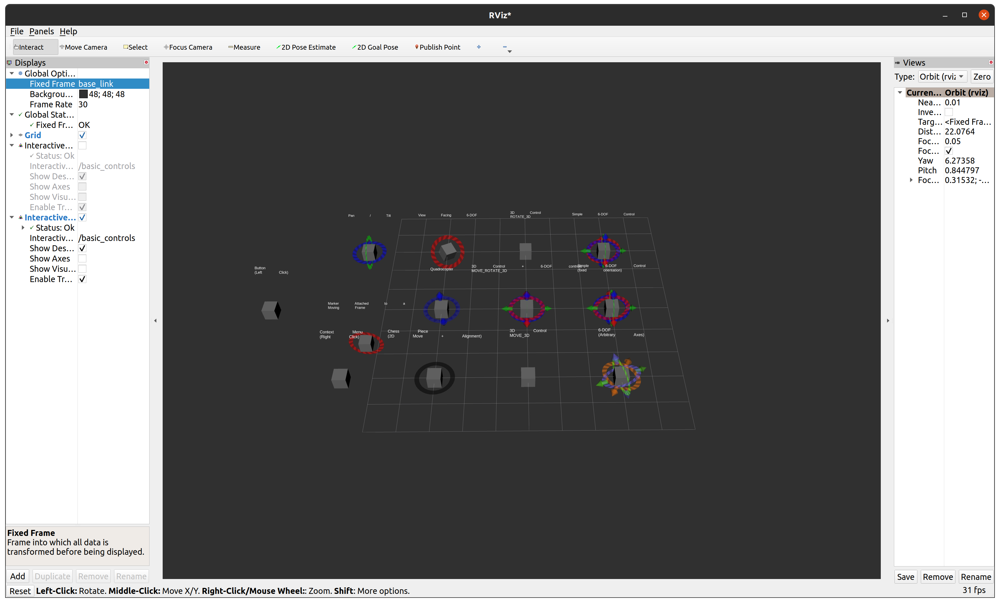

# Lab 6: Interactive Markers

## I. Learning Goals

- Learn to place and manipulate markers on the F1Tenth Simulator
- Introduction to C++ ROS2

## II. Overview

### Markers
Students should familiarize themselves with ROS2 markers. The 
[ROS docs](https://docs.ros.org/en/humble/Tutorials/Intermediate/RViz/Marker-Display-types/Marker-Display-types.html) 
have example usage and message parameter explanations. 


### Interactive Markers
Interactive Markers are similar to regular Markers, but they can be manipulated *within* rviz! 
Users can interact with them to change their position and rotation dynamically. 
This will be extremely helpful going forward, when students need to manipulate racelines in Pure Pursuit. 


A few example interactive markers have been provided in the package 'interactive_marker_tutorials' 
attached to is lab. Students will run the packages as follows:
```bash
~/your_cloned_student_ws$ colcon build --packages-select interactive_marker_tutorials
Starting >>> interactive_marker_tutorials
Finished <<< interactive_marker_tutorials [0.43s]                     

Summary: 1 package finished [0.77s]

~/your_cloned_student_ws$ source install/setup.bash
~/your_cloned_student_ws$ ros2 run interactive_marker_tutorials *INSERT EXECUTABLE HERE*

```

Don't forget, to find the executables available to run, you can use the following command in your 
terminal (after building and sourcing):
```bash
ros2 pkg executables
```

Students should be able to visualize the following rviz output from the basic_controls executable:



Delve into the example code and change the positions of the markers while examining output from the terminal. If you are not able to visualize the markers, you may need to change the fixed frame in rviz.
Students may decide the level of complexity they'd like in their markers, but should consider trying to 
utilize more functionality than the "simple" marker example.


###  Implementation
Within the dataset folder is a csv file that contains a path for the *levine_blocked* map. Students will 
create a raceline from this csv file using interactive markers. Students will use the markers to 
edit the raceline to work optimally for the *levine* map. 


###  Deliverables and Demonstrations

**Deliverable 1**: After you're finished, update the entire skeleton package directory with an interactive_markers package and 
directly commit and push to a repo shared with your TA. Your commited code should start and run in simulation smoothly.

**Demonstration**: Students will be required to show the TA their interactive marker implementation on levine. Students do not need to drive **at all**. Move the markers and demonstrate the ability to make changes to the raceline.


###  Grading Rubric

- Raceline Markers: **50** Points
- Interactive Markers: **50** Points


###  Extra Resources

Interactive Markers Documentation ROS: [LINK](http://wiki.ros.org/rviz/Tutorials/Interactive%20Markers%3A%20Getting%20Started)
Interactive Marker Tutorials: [LINK](https://github.com/ros-visualization/visualization_tutorials)